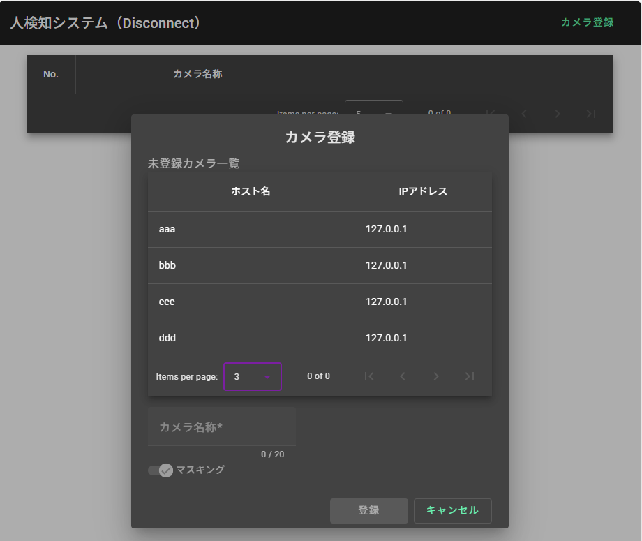

# 【画面設計書】カメラ登録ダイアログ
画像表示をしたい未登録カメラを登録する。

## 1. 画面レイアウト

## 2. 入出力項目

|No|名称|部品種類|表示|入力|入力桁数|文字種|入力制限|初期表示|アクションID|必須|項目説明|
|:---:|---|---|:---:|:---:|:---:|:---:|:---:|:---:|:---:|:---:|---|
|1|ページ名称|ラベル|○|---|---|---|---|---|---|---|ページの名称を表示する|
|2|未登録カメラリスト|リスト|○|---|---|---|---|※1|[1](#action1)|---|未登録カメラの情報を表示する|
|3|更新|ボタン|○|---|---|---|---|---|[2](#action2)|---|リストの内容を更新する|
|4|カメラ名称設定|テキストボックス|○|○|20|文字数字|---|---|[3](#action3)|○|カメラの名称を設定する|
|5|マスキング|スライドトグル|○|---|---|---|---|True|---|---|検知物体のマスキング設定を行う|
|6|登録|ボタン|○|---|---|---|---|無効|[4](#action4)|---|カメラを登録する|
|7|キャンセル|ボタン|○|---|---|---|---|---|[5](#action5)|---|ダイアログを閉じる|

※1 初期値としてカメラ接続情報要求の値を設定する

## 3. アクション明細

### 1. <a id="action1">未登録カメラリスト</a>
リストを選択する
1. テキストボックスとスライドトグルを有効にする

### 2. <a id="action2">更新</a>
更新ボタンを押下する
1. カメラ接続情報要求を行う
2. レスポンスのデータを一覧に表示し、処理を終了する

### 3. <a id="action3">カメラの名称設定</a>
テキストボックスに入力する

* 一文字以上入力されている場合
1. 登録ボタンを有効にし、処理を終了

* 文字が入力されていない場合
1. 登録ボタンを無効にする
2. メッセージ（カメラ名称を入力してください）を表示して、処理を終了

### 4. <a id="action4">登録</a>
登録ボタンを押下する
1. ホスト名とIPアドレス、カメラ名称とマスキングを合わせてカメラ登録要求を行う

2. レスポンスがTrueの場合  
メッセージ（登録が完了しました）を表示し、ダイアログを閉じ、カメラ一覧画面を表示する
3. レスポンスがFalseの場合  
エラーメッセージ（登録が失敗しました）をテキストボックスで表示し、処理を終了する

### 5. <a id="action5">キャンセル</a>
キャンセルボタンを押下する
1. テキストボックスに情報が保持されていた場合  
メッセージボックス（このまま終了しますか？Yes/No）を表示する  
  1.1 Yesの場合  
   ダイアログを閉じ、カメラ一覧画面を表示する  
  1.2 Noの場合  
   メッセージボックスを閉じて、処理を終了する

## 4. 付録
