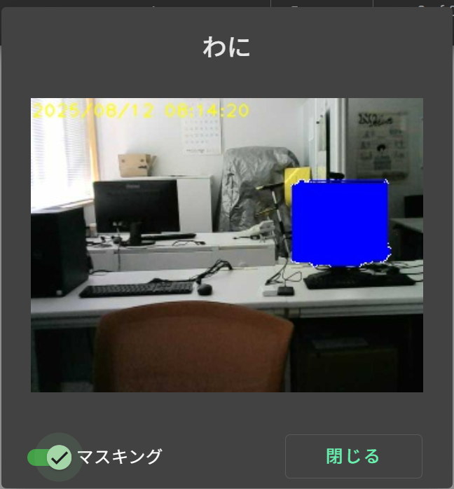

# 【画面設計書】画像表示ダイアログ  

サーバに接続されている登録済みカメラのストリーミング画像を表示する。

## 1. 画面レイアウト

## 2. 入出力項目

|No|名称|部品種類|表示|入力|入力桁数|文字種|入力制限|初期表示|アクションID|必須|項目説明|
|---|---|---|---|---|---|---|---|---|---|---|---|
|1|カメラ名称|ラベル|○|---|---|---|---|○[※1](#notice1)|---|---|カメラの名称を表示する|
|2|画像|イメージ|○|---|---|---|---|○[※1](#notice1)|---|---|カメラからのストリーミング画像を表示する|
|3|マスキング|スライドトグル|○|---|---|---|---|○[※1](#notice1)|[1](#action1)|---|検知物体のマスキング設定を行う|
|4|閉じる|ボタン|○|---|---|---|---|---|[2](#action2)|---|ダイアログを閉じる|

<a id="notice1">※1</a>：カメラ一覧画面から渡された値を設定する

## 3. アクション明細
### 1. <a id="action1">マスキング設定</a>  
スライドトグルをクリックする。
1. メッセージボックス（マスキングをON／OFFにしますか？）を表示する。  
2. 「はい」を選択した場合  
  スライドトグルの状態を基に「0x21：カメラ設定変更要求」を実行する。(No.4へ)
3. 「いいえ」を選択した場合  
  画像表示ダイアログに戻り、処理を終了する。
4. 「0x21：カメラ設定変更要求」の実行結果をメッセージボックスで表示し、処理を終了する。

### 2. <a id="action2">閉じる</a>
閉じるボタンを押下する。
1. ダイアログを閉じ、カメラ一覧画面を表示する。

## 4. 付録
